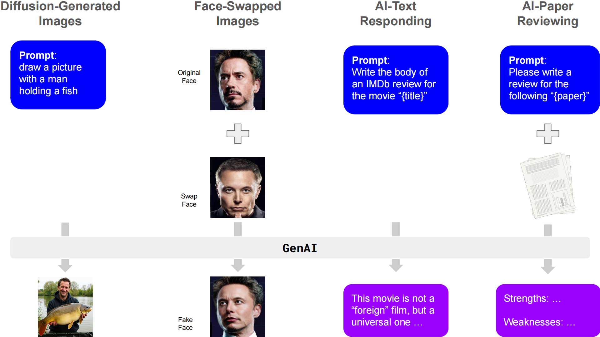
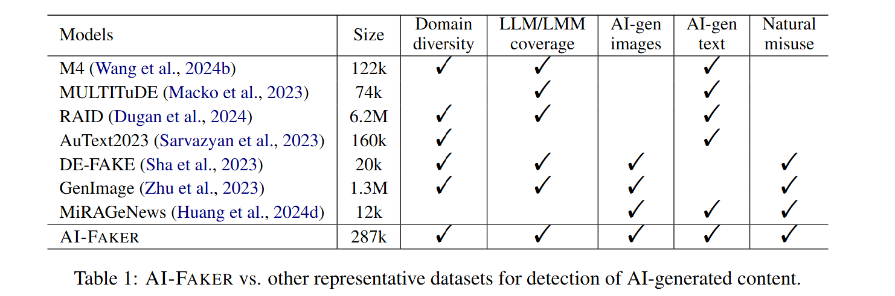

<p align="center">
  
</p>
<p align="center">
  <a href="https://arxiv.org/abs/2504.04279"><b>AI-FAKER</b></a>
</p>
<p align="center">
  <b>A Comprehensive Benchmark for Detecting, Attributing, and Explaining AI-Generated Images and Text</b>
</p>
<p align="center">
  <a href="https://github.com/CosimoFang/AI-Faker">
    
  </a>
  <a href="https://github.com/your-username/AI-Faker/blob/main/LICENSE">
    
  </a>
  <a href="https://arxiv.org/abs/XXXXXXXX">
    
  </a>
</p>

**AI-Faker** is a large-scale multimodal dataset introduced in the paper  
[**Could AI *Trace* and *Explain* the Origins of AI-Generated Images and Text?**](https://arxiv.org/abs/XXXXXXXX)  
It comprises over **280,000** samples spanning different generative AI models:
- **AI-Generated Images** vs. **AI-Modified Images**  
- **AI-Text Completion** vs. **AI-Generated Peer Reviews**  
- **General Use Cases** vs. **Malicious Use Cases**

AI-Faker is intended to be the go-to dataset for **model attribution**, **explanation**, and **robust forgery detection** across multiple modalities.

---

## Table of Contents
- [Key Features](#key-features)
- [Installation](#installation)
- [Dataset Overview](#dataset-overview)
- [Comparison](#comparison)
- [Loading the Dataset](#1-loading-the-dataset)
- [Citation](#citation)
- [License](#license)

---

## Key Features

- **Multimodal Coverage**: Spans both **visual** (fully and partially AI-generated images) and **textual** (short text completions and long-form peer reviews) content.
- **General vs. Malicious Use Cases**: Investigates standard generative tasks (e.g., text-to-image) alongside high-stakes misuse (e.g., face-swapping, AI-written academic reviews).
- **Model Diversity**: Includes outputs from popular **LMMs** (Midjourney, DALL-E, Stable Diffusion, etc.) and **LLMs** (GPT-4, Claude, LLaMA, etc.).
- **Explainability Benchmark**: Offers a unique testbed for **explanation generation**—whether an AI model (e.g., GPT-4) can **explain** *why* an image or text is attributed to a specific generator.

---

## Installation

You can clone this repository and install dependencies from `requirements.txt`:
```bash
git clone https://github.com/your-username/AI-Faker.git
cd AI-Faker
pip install -r requirements.txt
```


## Dataset Overview
Subset	Description	# Instances	Category

- **AI-Generated Images**	Fully diffused from text prompts (DALL-E, Midjourney).	50,000+	General

- **AI-Modified Images**	Partially modified (face-swapped)	28,551	Malicious

- **AI-Text Completion**	Short text completions (GPT-4, Cohere, LLaMA...)	50,000+	General

- **AI-Paper Review**	Full-length peer reviews generated by LLMs	70,000	Malicious


## Comparison:



## Download the dataset

|&emsp;&emsp;&emsp;&emsp;&emsp;&emsp;&emsp;| Size | Domains | Dataset Size | GenAI Models |
| -------- | :-------: | :-------: | :------------: | :------------------------------: |
|<a href="https://drive.google.com/file/d/1i4SlbNtzN2Pn4lSIHxK6sKliswp46OUb/view?usp=sharing"><b>**AI_generated_images**</b></a>|36.43Gb|Visual (natural + stylized prompts)|60,000 images (10K real, 50K AI-generated)|Midjourney, DALL-E, SDXL, Stable Diffusion, FLUX|
|<a href="https://drive.google.com/file/d/1lciPuPAsiv6jMp0QPhWJtwWYxOA1ZGLX/view?usp=sharing"><b>**AI_modified_images**</b></a>|1.69Gb|Multimedia (faces from movies, TikTok, YouTube)|28,551 images (6K real + 22.5K swapped)|Inswapper, SimSwap, UniFace, BlendSwap|
|<a href="https://drive.google.com/file/d/1dUnTL9Kb5RGlKVz16GWqxD6jgBgMYV7G/view?usp=sharing"><b>**AI_text_completion**</b></a>|36.3Mb|News, Books, Abstracts, Reviews, Reddit, Recipes, Wikipedia, Poetry|60,000 text samples (10K per LLM + human)|GPT-4, Cohere, LLaMA, Mistral, MPT|
|<a href="https://drive.google.com/file/d/1f_31prFhRU8FAui3K___UgH6bYAwIFDR/view?usp=sharing"><b>**AI_paper_review**</b></a>|127.6Mb|Academic Paper Reviews (OpenReview)|70,000 text samples (10K per LLM + human)|GPT-4o, Claude 3.5, Gemini 1.5, DeepSeek, LLaMA-3, Mistral|


## Citation
If you find AI-Faker or its accompanying code valuable for your research, please cite our paper:
```bibtex
@misc{fang2025aitraceexplainorigins,
      title={Could AI Trace and Explain the Origins of AI-Generated Images and Text?}, 
      author={Hongchao Fang and Yixin Liu and Jiangshu Du and Can Qin and Ran Xu and Feng Liu and Lichao Sun and Dongwon Lee and Lifu Huang and Wenpeng Yin},
      year={2025},
      eprint={2504.04279},
      archivePrefix={arXiv},
      primaryClass={cs.CL},
      url={https://arxiv.org/abs/2504.04279}, 
}
```
